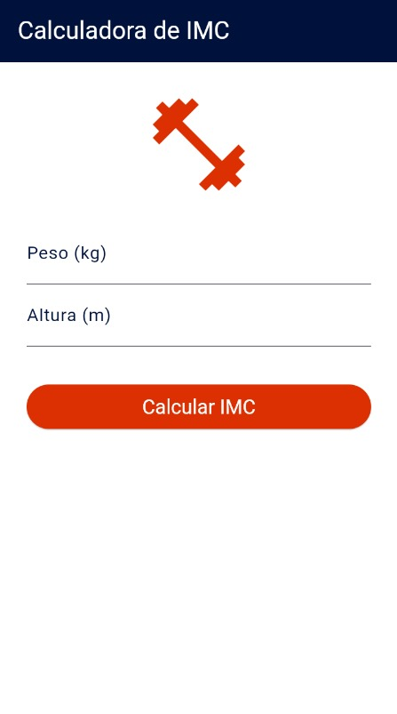
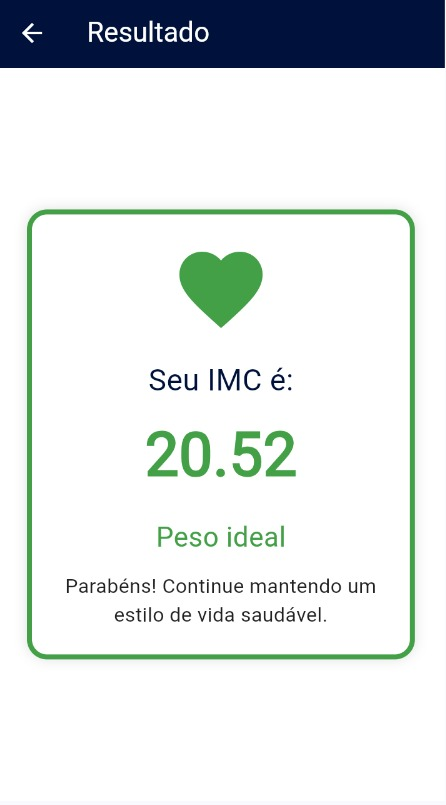

# Calculadora de IMC

## Descrição do Aplicativo

Este aplicativo tem como objetivo calcular o Índice de Massa Corporal (IMC) com base no peso e altura informados pelo usuário. Após o cálculo, o app exibe a classificação do IMC (como "Peso ideal", "Obesidade", etc.), uma mensagem orientativa e uma cor correspondente ao resultado.

### Objetivo:
Auxiliar os usuários a monitorarem sua saúde corporal de maneira prática e rápida.

## Matrícula dos componentes da dupla

- Aluno 1: Guilherme Kunsch - 123100002
- Aluno 2: João Victor Sarmento - 123100062

